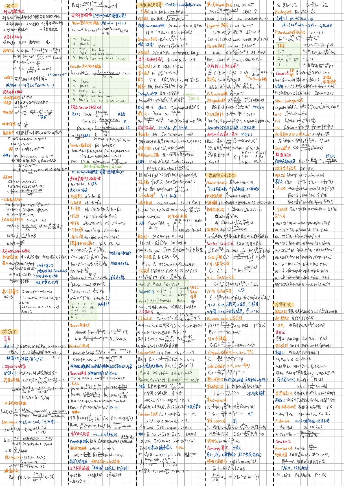
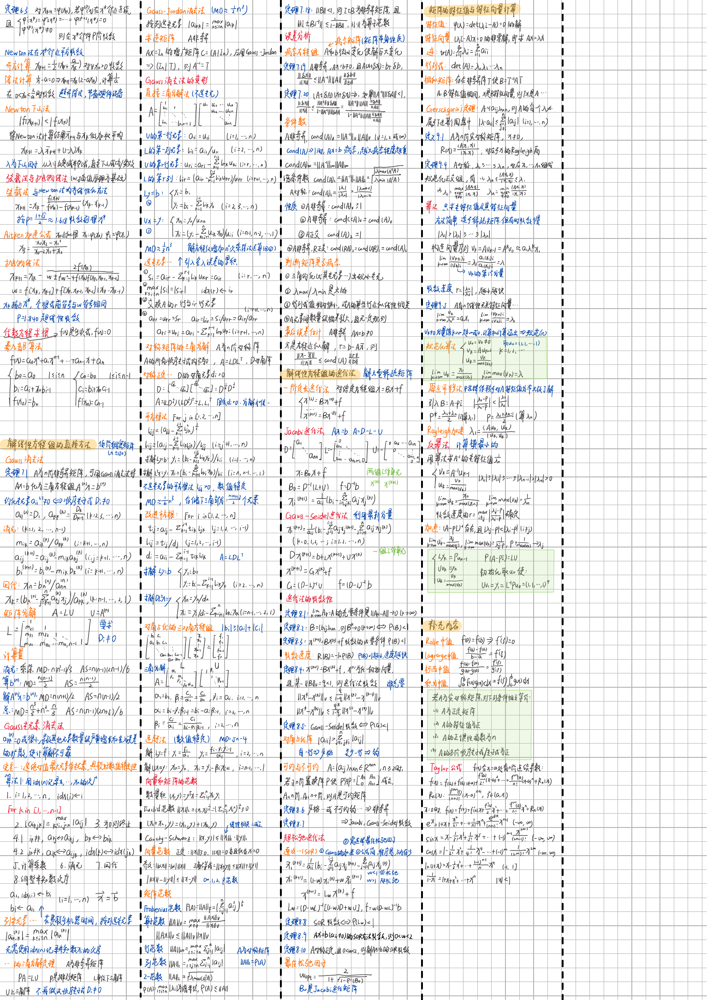

+++
title = "2025春 计算方法 期末笔记"
description = "2025春 计算方法 期末笔记"
summary = "2025春 计算方法 期末笔记"
date = "2026-07-02T18:22:38+08:00"
draft = false
postType = "study"
tags = ["数字花园", "PDF"]
categories = ["学习笔记"]
showTableOfContents = false
showWordCount = true
showReadingTime = true
wordCount = 31
readingTime = 1
pdfSource = "assets/2025春-计算方法-期末笔记.pdf"
+++

  
计算方法为半开卷考试，只允许带一张A4纸，故掏出焚诀 ⬇️

  <a class="article-download-link" href="assets/2025春-计算方法-期末笔记.pdf" download>下载 PDF</a>

使用的笔记软件是云记，把画幅拉到最大，笔触放到最小抄写即可。
