+++
title = "前端设计小trick"
description = "前端设计小trick"
summary = "前端设计小trick"
date = "2026-07-09T12:53:08+08:00"
draft = false
postType = "study"
tags = ["数字花园", "Notion"]
categories = ["学习笔记"]
showTableOfContents = true
showWordCount = true
showReadingTime = true
wordCount = 1403
readingTime = 3
notionSource = "前端设计小trick 398f867979aa8007ae37e63dafa46006.md"
+++


### 一、灵感参考与案例库

这一类可以用于 **看别人怎么设计，找风格、找页面结构、找交互案例。**

#### Mobbin

[Discover iOS apps | Mobbin — UI & UX design inspiration for mobile & web apps](https://mobbin.com/discover/apps/ios/latest)

一个真实 App UI/UX 案例库，适合研究成熟产品的页面设计、交互流程和信息架构。官方介绍它收录了 1000+ iOS & Web apps 和 200 sites，可以用于找登录页、Onboarding、个人中心、设置页、搜索页、订阅页、支付页、首页信息流等真实产品案例。

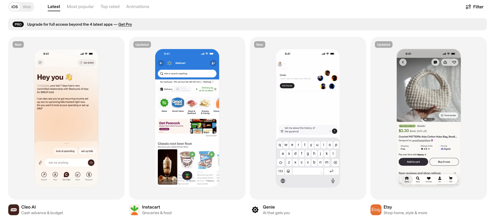

#### Cosmos

[Explore / Cosmos](https://www.cosmos.so/explore)

这是一个高质量视觉灵感收藏和发现平台，适合找 **艺术、品牌、室内、字体、建筑、界面、电影、动效、科技** 等跨领域参考。

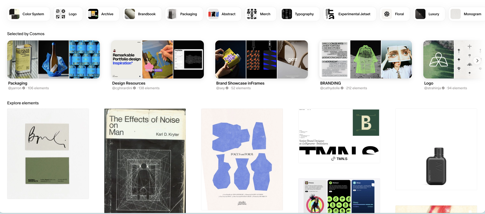

#### Figma Community

Figma 官方社区资源入口，适合找设计系统、网页模板、App UI Kit、原型文件、图标套件、作品集模板。

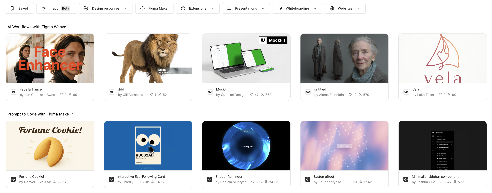

#### Gary Bunt Art

[Artist Gary Bunt](https://www.garybuntart.com/)

英国艺术家 Gary Bunt 的个人艺术网站，整体风格偏 **温暖、朴素、叙事感、乡村生活、绘本感**。适合找温暖叙事风、手绘感、乡村感、绘本式网页或个人主页情绪参考。

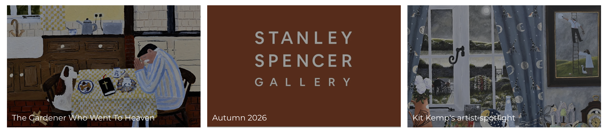

#### Layers

[Explore | Layers](https://layers.to/explore)

这是一个偏 **设计师社区 / 作品展示 / UI 灵感** 的平台，可以浏览 UI、Product Design、Web Design、UX、Landing Page 等设计作品，适合找网页排版、Landing Page、作品集页面、卡片布局、现代 UI 视觉参考。

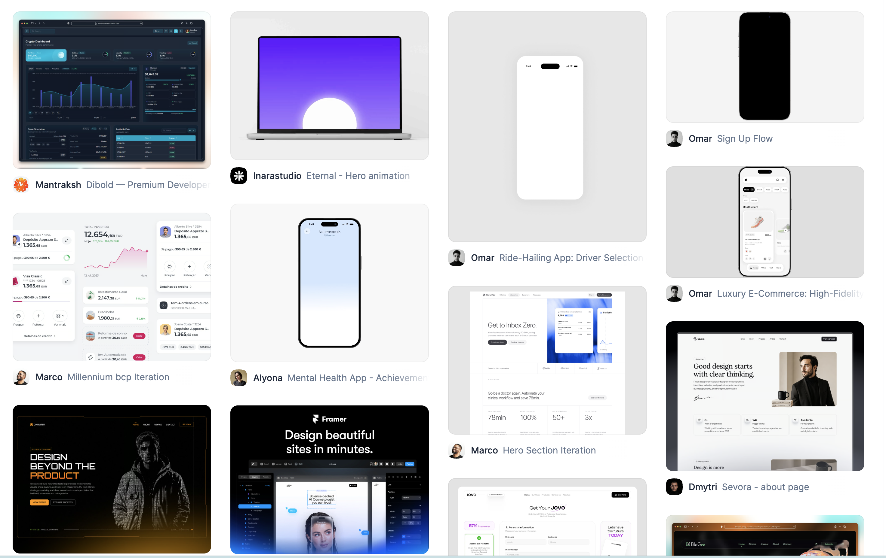

#### 21st.dev Community Components

[Discover community-made UI components | 21st](https://21st.dev/community/components)

一个偏前端开发者向的 React 组件和模板社区，主打可直接参考或复用的现代 UI 组件。适合找按钮、卡片、导航栏、登录页、Dashboard、Hero Section、Pricing Section 等现成组件灵感。

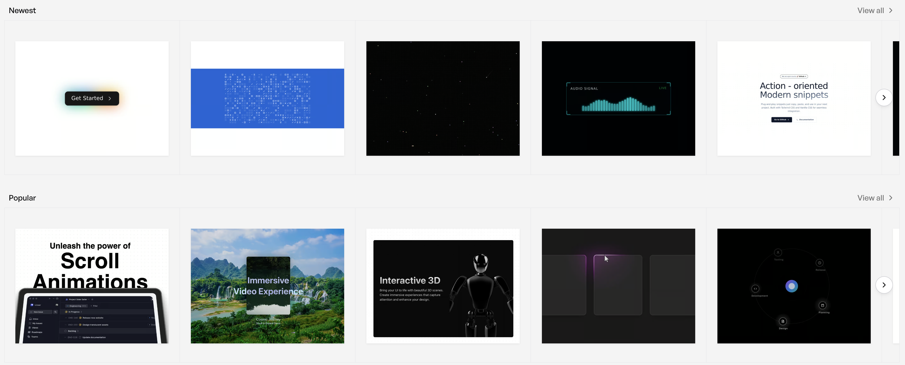

### 二、素材与视觉资产

这一类可以 **给页面找可以直接使用或改造的素材。**

#### iconfont

[iconfont-阿里巴巴矢量图标库](https://www.iconfont.cn/?utm_source=chatgpt.com)

中文图标资源库，适合快速查找、下载和管理网页项目里的 SVG 图标、Icon Font 图标和 Symbol 图标，图标资源非常全非常好用！

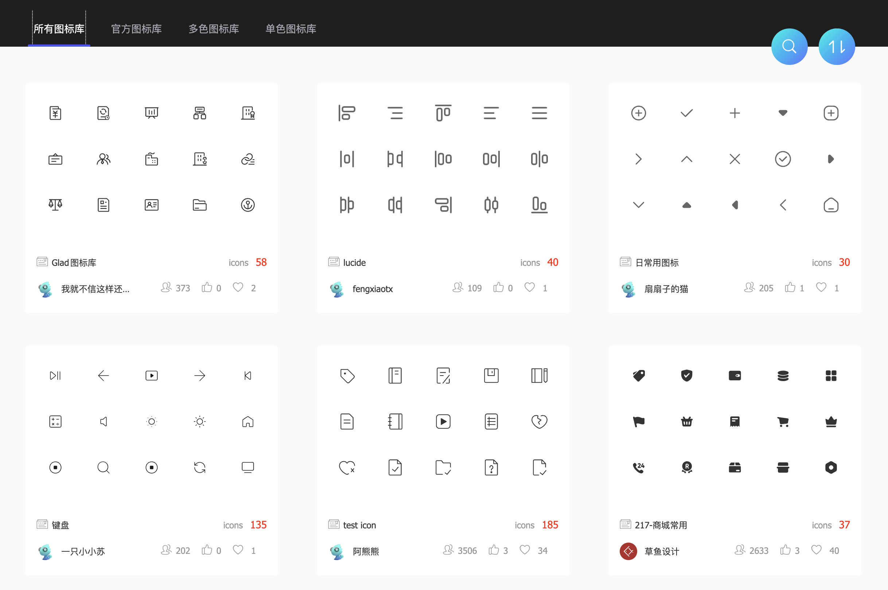

#### DiceBear

[DiceBear | Open Source Avatar Library & API](https://www.dicebear.com/?utm_source=chatgpt.com)

一个开源头像生成库，可以根据一个 seed 自动生成稳定的 SVG 头像。适合做用户系统默认头像、社区产品头像、个人主页里的趣味 avatar、项目 Demo 里的假用户数据。

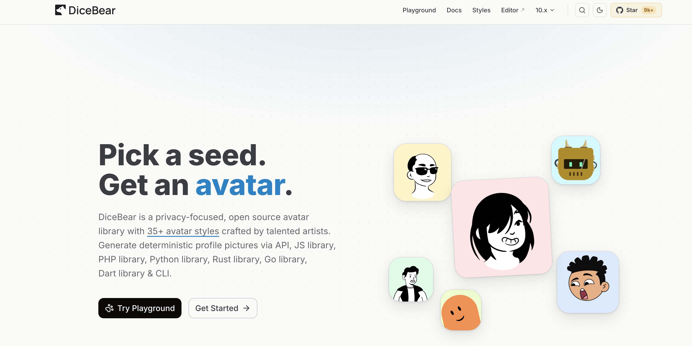

#### StardewValley Assets

[https://github.com/Huu-Yuu/StardewValley-Assets](https://github.com/Huu-Yuu/StardewValley-Assets)

一个整理 **Stardew Valley 星露谷风格图片资源** 的仓库，包含地图、NPC、物品等素材，适合找像素游戏 UI、田园风地图、NPC 立绘、物品图标、复古小游戏视觉参考。

#### LottieFiles

[LottieFiles: Download Free lightweight animations for website & apps.](https://lottiefiles.com/)

Lottie 动效素材和管理平台，适合查找、预览、下载和测试 Lottie 动画。

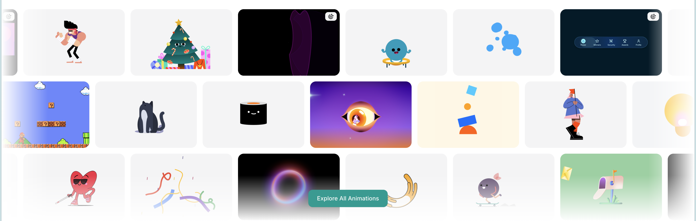

#### GSAP

[GreenSock](https://gsap.com/community/)

GSAP 官方社区，适合找滚动动画、文字动画、SVG 动画、页面转场等网页动效案例。

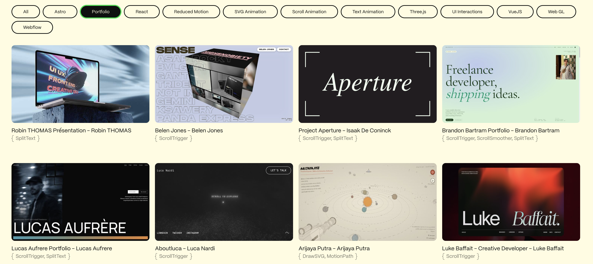

#### Pixabay

[免费正版高清图片素材库 超过6.2百万张优质图片和视频素材可供免费使用和下载 - Pixabay](https://pixabay.com/zh/)

把免费图片、插画、矢量图、视频、音乐、音效、3D 模型等素材整合在一起的素材库，适合给网页找背景图、封面图、插画和氛围素材。其内容覆盖 Photos、Illustrations、Vectors、Videos、Music、Sound Effects、3D Models、GIFs 等类型

#### MoonPixel

[月球像素社区 - 发现精彩像素艺术](https://moonpx.art/)

这是一个专注于 **像素艺术 Pixel Art** 的社区网站，可以发现像素画作品，适合找像素风网页、小游戏、复古 UI、个人主页彩蛋、Stardew Valley 风格视觉参考。

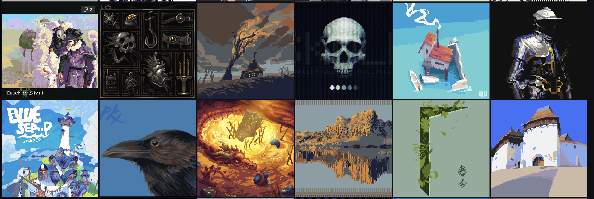

### 三、辅助AI生成前端

这一类可以 **让 AI 直接帮你生成页面、动效、组件，或者约束 AI 的设计风格。**

#### DESIGN.md

[https://github.com/google-labs-code/design.md](https://github.com/google-labs-code/design.md)

Google Labs 开源的 **DESIGN.md 格式规范**，用于把一个产品的视觉风格、设计 token 和设计理由写成 AI Agent 能读懂的文件。它可以给 coding agents 一个持久、结构化的设计系统理解，适合放在项目根目录。能够让 AI Agent 在写前端时保持统一的颜色、字体、圆角、间距、组件风格和设计理念。

#### awesome-design-md

[https://github.com/VoltAgent/awesome-design-md](https://github.com/VoltAgent/awesome-design-md)

一个收集 **DESIGN.md 设计系统文件** 的资源库，里面整理了很多参考品牌/网站风格的 DESIGN.md。每个案例通常包含 `DESIGN.md`、`preview.html`、`preview-dark.html`，可以直接复制到项目里，让 AI Agent 生成更统一的 UI。

适合找现成的设计风格模板，比如科技感、极简风、复古风、品牌风、开发者网站风。

它更像是 DESIGN.md 的“模板库”。如果不知道自己的项目该用什么设计风格，可以先从这里挑一个接近的，再让 AI 按这个风格写前端。

#### Taste Skill

[https://github.com/Leonxlnx/taste-skill](https://github.com/Leonxlnx/taste-skill)

一个面向 AI Coding Agent 的前端审美 Skill，目标是减少 AI 生成的“模板感 UI”，让界面在布局、字体、动效、间距和层级上更有设计感。它是 “Anti-Slop Frontend Framework for AI Agents”，可以提升 AI 生成界面的 layout、typography、motion 和 spacing。

#### GSAP Skill

[https://github.com/greensock/gsap-skills](https://github.com/greensock/gsap-skills)

帮助 AI Agent 使用 **GSAP** 制作网页动效，适合复杂一点的前端动画，比如入场动画、滚动动画、卡片动效和页面转场。

#### Text to Lottie Skill

[lottie/skills/text-to-lottie at main · diffusionstudio/lottie](https://github.com/diffusionstudio/lottie/tree/main/skills/text-to-lottie)

把文字描述、SVG 或 Logo 快速转成 **Lottie 动效**，适合做启动页、Loading、Logo Reveal 和网页小动画。

#### three-scope-map-skill

[https://github.com/songsummer920-dazzle/three-scope-map-skill](https://github.com/songsummer920-dazzle/three-scope-map-skill)

用于生成 **Three.js 3D 地图可视化** 的 Skill，适合做地图、空间展示、地理数据展示和可视化大屏。
